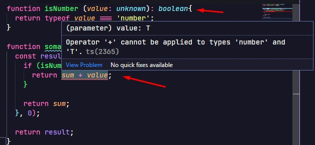

# Type predicate

É usado para quando uma função retornar um **boolean true** o valor do parametro é do tipo indicado depois do **is**.

Normalmente é usado nesses casos:


> Quando nossa verificação não deixa explicitio para o TS que o valor é aquele que a verificação está indicando.

Quando substituímos o boolean por ```value is number``` o erro some.
